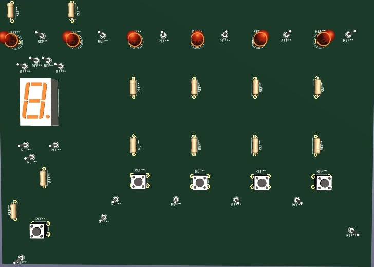

# 🎮 Jogo de Reação Bare-Metal (BeagleBone Black)

Este é um projeto de sistema embarcado **bare-metal** para a placa **BeagleBone Black (Processador TI AM335x)**.

O projeto implementa um jogo de tempo de reação competitivo para dois jogadores, controlando diretamente o hardware, incluindo GPIOs, timers e interrupções.

## 🎯 FuncionalidadesGET

* **Modo de 2 Jogadores:** O jogo alterna entre o Jogador 1 e o Jogador 2.
* **4 Níveis Diferentes:** Possui 4 sequências de jogo pré-programadas (`modo1` a `modo4`), cada uma com diferentes tempos e padrões de LED.
* **Contagem Regressiva:** Uma contagem regressiva de 5 segundos no display de 7 segmentos inicia cada rodada.
* **Sistema de Pontuação:** A pontuação é baseada no tempo de reação. Quanto mais rápido o jogador pressionar o botão correto, mais pontos ele ganha (ex: < 400ms = 4 pontos, < 700ms = 3 pontos).
* **Feedback Visual:**
    * **Display de 7 Segmentos:** Mostra a contagem regressiva e a pontuação atual.
    * **LEDs de Jogo (4x):** Indicam qual botão deve ser pressionado.
    * **LEDs de Status (2x):** Piscam para indicar acerto (`LED_6`) ou erro (`LED_7`).
* **Anúncio de Vencedor:** Ao final das duas rodadas, o sistema compara as pontuações, exibe a pontuação vencedora no display e envia uma mensagem (ex: "JOGADOR 1 É O VENCEDOR!") via console UART.

## 🛠️ Detalhes Técnicos e Arquitetura

Este projeto foi desenvolvido sem o uso de bibliotecas de sistema operacional (bare-metal), interagindo diretamente com os registradores do processador AM335x.

### 1. Inicialização do Sistema (em `main.c`)

* **WDT (Watchdog Timer):** O Watchdog Timer é desabilitado (`WDTimerDisable()`) logo no início para prevenir que o processador reinicie durante a execução do programa.
* **Configuração de Hardware:** O `main` chama rotinas de setup para inicializar o módulo UART (para debug), o Timer (DMTIMER7), os pinos de GPIO (botões e LEDs) e o display.

### 2. Lógica de Jogo (Interrupções + Timer)

O núcleo do jogo **não usa um loop de *polling*** para verificar os botões. Em vez disso, ele usa uma combinação eficiente de **interrupções e timers**:

1.  **Configuração de Interrupção:** Os 5 botões (4 de jogo + 1 de start) são configurados para gerar uma interrupção na borda de subida (`RISINGDETECT`).
2.  **Início da Jogada:** Um LED é aceso (`ledON`) e uma função de timer (ex: `getTimerBut3(1600)`) é chamada.
3.  **Medição de Tempo:** Esta função (`getTimerBut3`) inicia um loop que conta em milissegundos, mas que é **interrompido** se a flag de interrupção daquele botão (`getFlag_gpio2A()`) for setada como `true`.
4.  **Retorno:** A função retorna o tempo exato (em `mSec`) que o jogador levou para pressionar o botão.
5.  **Pontuação:** A lógica no `modo1` (etc.) compara o tempo retornado e atribui os pontos. Se o tempo estourar (ex: 1600ms), o jogador não pontua.

### 3. Lógica de Estados (em `main.c`)

O `main.c` contém a máquina de estados principal do jogo:
* Espera pelo botão de "Start" (`getFlag_gpio3A()`).
* Executa a contagem regressiva (`start()`).
* Executa o modo de jogo (`modo1` a `modo4`) para o Jogador 1.
* Armazena a pontuação em `pointsP1`.
* Executa o mesmo modo para o Jogador 2, armazenando em `pointsP2`.
* Chama a função `winner()` para declarar o resultado.
* Reseta o estado e espera um novo jogo.

## Hardware Utilizado

* **Plataforma:** BeagleBone Black (TI AM335x - ARM Cortex-A8)
* **Componentes:**
    * 4x Botões (Push-buttons) para jogo
    * 1x Botão (Push-button) para "Start"
    * 4x LEDs (Alvos do jogo)
    * 2x LEDs (Status de Acerto/Erro)
    * 1x Display de 7 Segmentos (Contagem e Pontuação)
    * Resistores e protoboard/PCB